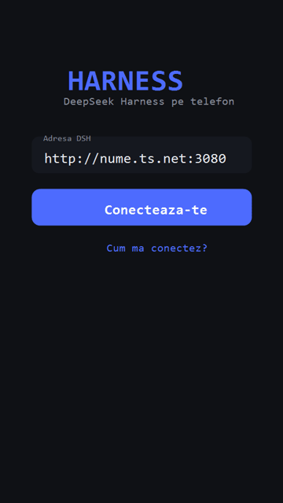

# Harness — DeepSeek Harness on your phone (Android)

A native Android app (Kotlin + Jetpack Compose) that talks to **your own DeepSeek Harness** instance over **Tailscale** — from your phone, anywhere. Live streaming chat, model switching, workspace files, image attachments, light/dark themes.

> Each user connects to their **own** DSH instance, through their **own** tailnet. The app never accesses someone else's PC.

> **Beta.** Core features work; some edges are still rough. Updates install from inside the app (or download the latest APK from GitHub Releases).

**Demo (illustrative):**



---

## What you need
- A **PC with DeepSeek Harness** (`dsh`) installed.
- **Tailscale** installed on the PC **and** your phone, signed into the **same tailnet**.
- An Android phone (Android 8+).

---

## 1. Set up remote access on the PC (once)

On the PC, run the setup script (open PowerShell and):

```powershell
# after downloading the script:
powershell -ExecutionPolicy Bypass -File .\setup-dsh-remote.ps1
```

The script automatically:
- binds the DSH web GUI to `0.0.0.0` (via the `web` profile patch),
- adds a firewall rule allowing port **3080** **only from the tailnet** (`100.64.0.0/10`),
- prints the **address** to enter in the app (e.g. `http://100.x.y.z:3080` or `http://host.ts.net:3080`).

(It will ask for administrator rights once — normal.)

After the script: **restart DSH** — `Ctrl+C` in its terminal, then `ollama launch dsh` (or `dsh web`).

### Manual (without the script)
1. Edit `$DSH_HOME\profiles\web\cordis.patch.yml` and add:
   ```yaml
   - id: webserver
     config:
       host: '0.0.0.0'
       port: 3080
   ```
2. Firewall rule (from an admin terminal):
   ```
   netsh advfirewall firewall add rule name="DSH Web tailnet" dir=in action=allow protocol=TCP localport=3080 remoteip=100.64.0.0/10
   ```
3. Restart DSH.

---

## 2. Install the app on your phone

- Download the latest **`app-release.apk`** from **GitHub Releases** (the *Assets* section of a release).
- Open the file on your phone → allow *install from unknown sources* → **Install**.

---

## 3. Connect
1. Open **Harness**.
2. Enter the address shown by the script (e.g. `http://host.ts.net:3080`), **or scan the connect QR** the script generates.
3. Tap **Connect** — you'll see your conversations, switch models (top button / `/model`), attach images, browse the workspace and Shared files.

**Quick setup (QR):** the `setup-dsh-remote.ps1` script generates a **per-user QR** (saved as `dsh-connect-qr.png` in your home folder). Scan it with the phone (Harness installed) → the app opens with your address pre-filled (deep link `harness://open?url=…`). No typing.

---

## 4. Shared files (download / preview over Tailscale)
Put files in a **`shared`** folder in your workspace (e.g. `G:\deepseek harness\shared`). They become downloadable/previewable:
- **In the app:** the **Shared** tab (from Workspace) lists them; images preview inline, other files download + open.
- **In a browser:** open `http://<host>:3080/shared/index.html` — a gallery that previews images/PDFs and gives download buttons.
- Any file is also reachable at `http://<host>:3080/shared/<filename>` from any device on the tailnet.

---

## Release / CI (GitHub Actions)
- Every push / PR builds the APK automatically (`.github/workflows/build.yml`).
- For a **signed release**: in GitHub → repo → *Settings → Secrets and variables → Actions*, set:
  - `SIGNING_STORE` (keystore as base64), `SIGNING_STORE_PASSWORD`, `SIGNING_KEY_ALIAS`, `SIGNING_KEY_PASSWORD`.
  - Without secrets, the build uses the **debug** key (installable, fine for beta).
- Push a **tag** `v1.x` → CI creates a **GitHub Release** with `app-release.apk` in *Assets*.

---

## Publishing on GitHub (steps + commands)

Create an empty repo on GitHub (e.g. `harness-android`, without a README so there's no conflict), then from the project folder:

```bash
# link the remote repo
git remote add origin https://github.com/<YOU>/harness-android.git
git push -u origin main
```

**Release** — create a tag and CI builds + attaches the APK to a Release:
```bash
git tag v1.0
git push origin v1.0
```

**Signing secrets** (optional, for signed releases): in the repo → *Settings → Secrets and variables → Actions → New repository secret*:
| Secret | Value |
|---|---|
| `SIGNING_STORE` | your keystore content in **base64** (`certutil -encode release.keystore tmp.b64`, then paste the content) |
| `SIGNING_STORE_PASSWORD` | keystore password |
| `SIGNING_KEY_ALIAS` | key alias |
| `SIGNING_KEY_PASSWORD` | key password |

> Without secrets, releases are built with the debug key — installable, but updates between releases must use the same signature.

---

## Security
DSH has no authentication. Port 3080 is open **only** to the tailnet (firewall rule `remoteip=100.64.0.0/10`) — anyone can reach it **only** if they are on your tailnet. Do **not** expose port 3080 on the public network / LAN.

---

## Development
Kotlin + Compose · `compileSdk 36` · Gradle 8.14.3.

Build the APK:
```bash
./gradlew assembleRelease
```
The APK is written to `app/build/outputs/apk/release/app-release.apk`. Signing reads `keystore.properties` (created locally, **not committed**); CI gets it from GitHub Secrets.
